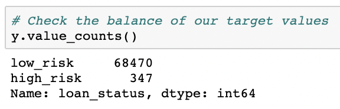
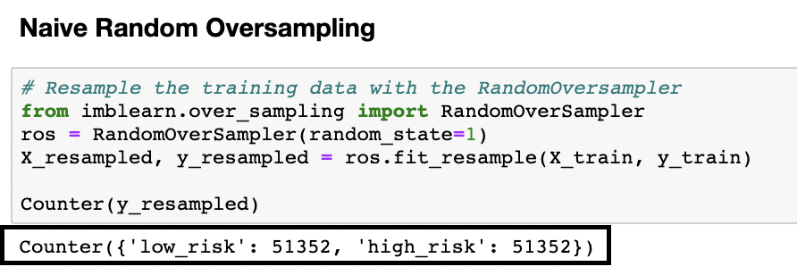
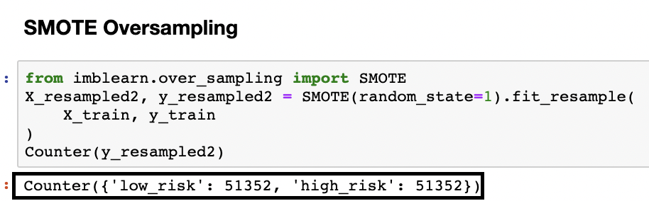

# Credit_Risk_Analysis
Using imbalanced-learn and scikit-learn libraries to build and evaluate machine-learning models predicting credit card risk using resampling. 
# Overview of the analysis: 
Explain the purpose of this analysis.

# Results: 
Using bulleted lists, describe the balanced accuracy scores and the precision and recall scores of all six machine learning models. Use screenshots of youtputs to support your results.

| y values counts, dataset | y values counts, RandomOverSampler | y values counts, SMOTE
:-------------------------:|:-------------------------:|:---------------------------:
 |  | 

| accuracy score and confusion matrix, RandomOverSampler | accuracy score and confusion matrix, SMOTE 
:------------------------:|:---------------------------------:
 | 

| classification report, RandomOverSampler | classification report, SMOTE 
:---------------------:|:---------------------------:
 | 

| accuracy score and confusion matrix, ClusterCentroids | accuracy score and confusion matrix, SMOTEENN |
:----------------------:|:------------------------------:
 | 

| classification report, ClusterCentroids | classification report, SMOTEENN |
:-------------------------:|:---------------------------------:
 | 

| accuracy score and confusion matrix, RandomForest | accuracy score and confusion matrix, EasyEnsemble 
:--------------------------:|:------------------------------------:
 | 

| classification report, RandomForest | classification report, EasyEnsemble
:-------------------------------:|:---------------------------:
 |  

# Summary: 
Summarize the results of the machine learning models, and include a recommendation on the model to use, if any. If you do not recommend any of the models, justify your reasoning.
