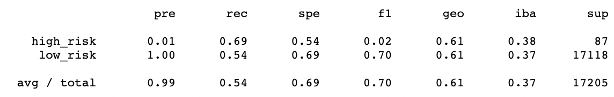

# Credit_Risk_Analysis

Using Python imbalanced-learn and scikit-learn libraries to build and evaluate six different machine-learning models at predicting credit card risk, using resampling and ensemble techniques. 

# Overview of the analysis: 

I've evaluated several different supervised machine-learning models for predicting credit risk using a credit card credit dataset from LendingClub, a a peer-to-peer lending services company. Given the imbalanced nature of the credit card credit dataset, with bad loan applications unsurprisingly accounting for a small percentage of the outcomes (in this case 347 out of 68,817 total outcomes), the first four models involve oversampling, undersampling and combination techniques. These techniques adjust the class distribution of the two potential outcomes in the training datasets of the models in order to influence the fit and reduce bias toward the majority class. The distribution of the testing dataset remains random in order to evaluate the performance of the model. The last two models involve ensemble learning techniques, which combine multiple "weak learning" models to improve the accuracy and robustness of the model while avoiding overfitting. The anticipated outcome is that at least one of these models will be sufficient at predicting bad loan applications despite the underrepresentation of bad loan application outcomes in the given dataset. 

# Results: 

The image below is a key to the confusion matrices which will be discussed in the results for each of the following six machine-learning models. In each of the confusion matrices, the numbers listed from top left to bottom right will indicate the diagnostic results "True Positive", "False Negative", "False Positive" and "True Negative" respectively.

 These diagnostic results are used in generating the accuracy scores and classification report for each model. 
 - `Accuracy` is measured as the percentage of correct diagnoses over total diagnoses, or (TP + TN) / (TP + TN + FP + FN).
 - `Precision`, or 'pre', measures the reliability of a positive classification, and is thus also known as the positive predictive value. It is calculated as TP / (TP + FP).  
 - `Sensitivity`, or 'rec' for 'recall', measures the percentage, or proportion, of true positives out of all the samples that have the condition. It is calculated as TP / (TP + FN)
- `The F1 Score`, also known as the 'harmonic mean', can be thought of as a measure of the imbalance between precision and sensitivity scores, with a pronounced imbalance yielding a low F1 Score. It is calculated as 2(Precision * Sensitivity) / (Precision + Sensitivity). 

Below is an image illustrating the difference between precision and sensitivity. As can be deduced, precision may be the better measure when it is important that a positive diagnosis is correct a high percentage of the time, where sensitivity may be the better measure when it is important not to miss any positive diagnoses. 

The first two machine learning models, RandomOverSampler and SMOTE, used oversampling techniques to resample the minority class. In both models the majority "low risk" and minority "high risk" outcomes were evened out in the training dataset to account for 51,352 occurences each. 

While a perfect accuracy score on a training dataset may be indicative of an overfitted model, the accuracy scores for both these models are still rather low. However, accuracy may not be the best measure for predicting high risk loans given the infrequency of their occurance. For example, given the known 347 high-risk loans out of 69,164 total loans in the dataset, if a model incorrectly predicted that all 69,164 loans were low risk, it would have an accuracy score of 99.5%, despite missing every single high risk loan. Let's move on to some potentially more informative measures in the classification report below. 

| accuracy score and confusion matrix, RandomOverSampler | accuracy score and confusion matrix, SMOTE 
:------------------------:|:---------------------------------:
 | 

Both oversampling models had perfect precision for positively predicting instances of low risk loans, but extremely low precision for positively predicting instances of high risk loans. The recall (sensitivity) scores for low and high risk predictions are better than 50/50, but not impressive. The F1 scores, which are high for low risk predictions and low for high risk predictions, reflect the drastic differences in precision between low and high risk predictions compared to recall scores which are similar for both categories. The "support" column shows the actual number of occurances of low and high risk loans in the testing dataset. Recall that oversampling evened out the occurences of both categories in the *training* dataset, but the testing dataset remains reflective of the categorical proportions present in the total data.  

| classification report, RandomOverSampler | classification report, SMOTE 
:---------------------:|:---------------------------:
 | 

The second two machine learning models, ClusterCentroids and SMOTEENN, used undersampling and combination sampling techniques respectively. Undersampling eliminates instances of the majority class (rather than resampling the minority class as in oversampling), where combination sampling combines oversampling and undersampling techniques. In ClusterCentroids, the "low risk" and "high risk" outcomes were evened out in the training dataset to 260 occurences each, making for a relatively small training dataset. In SMOTEENN, the "low risk" and "high risk" outcomes were evened out in the training dataset to 46,389 and 51,351 occurences respectively. 

As in both oversampling models, the accuracy scores for the undersampling and combination sampling models remain low. 

| accuracy score and confusion matrix, ClusterCentroids | accuracy score and confusion matrix, SMOTEENN |
:----------------------:|:------------------------------:
 | 

The precision for both models is once again perfect for positively predicting instances of low risk loans, but extremely low for positively predicting instances of high risk loans. The recall scores are fairly consistent across both categories, with the F1 scores once again reflecting the high imbalance between precision and recall for positively predicting high risk loans. There were 87 actual instances of high risk loans and 17,118 instances of low risk loans in both testing datasets.  

| classification report, ClusterCentroids | classification report, SMOTEENN |
:-------------------------:|:---------------------------------:
 | 

The final two machine-learning models, RandomForest and EasyEnsemble, used ensemble learning techniques to combine multiple "weak learning" models in order to.... 

*** Discussion of accuracy score and confusion matrix **** 

| accuracy score and confusion matrix, RandomForest | accuracy score and confusion matrix, EasyEnsemble 
:--------------------------:|:------------------------------------:
 | 

*** Discussion of classification report **** 

| classification report, RandomForest | classification report, EasyEnsemble
:-------------------------------:|:---------------------------:
 |  

# Summary: 
Summarize the results of the machine learning models, and include a recommendation on the model to use, if any. If you do not recommend any of the models, justify your reasoning.

What type of assessment if best for fraud prediction? Why? Which model had the best score for this? 
